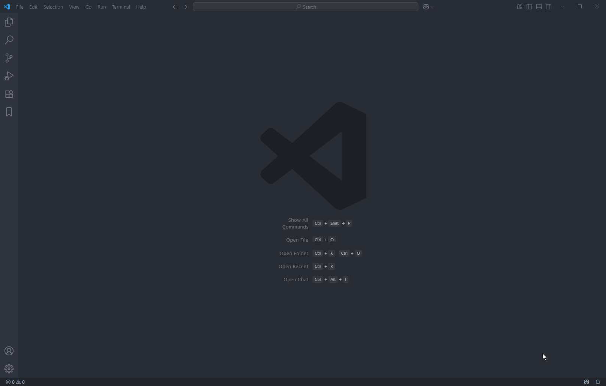
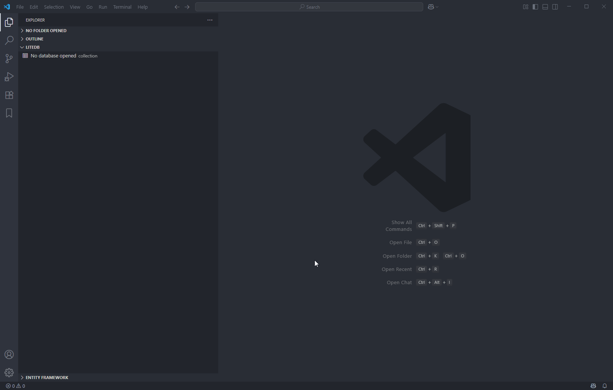
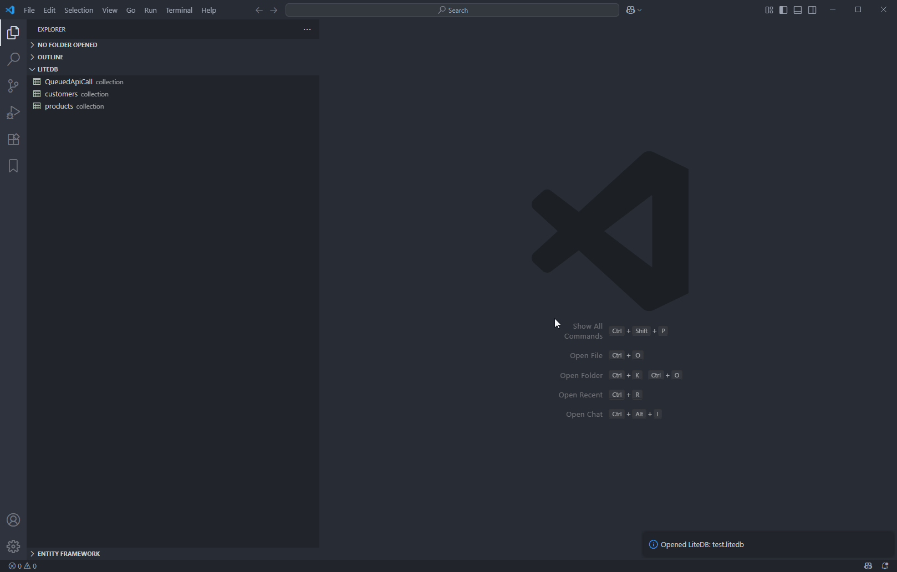
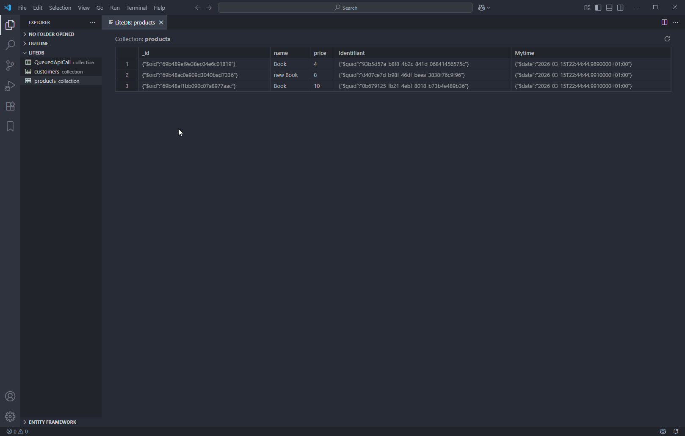

# LiteDB VS Code Extension

This is a Visual Studio Code extension for working with [LiteDB](https://www.litedb.org/) databases. It provides a graphical interface to open, browse, and query LiteDB files directly from VS Code.

## Features

- Open and explore LiteDB databases (*.db files)
- View collections and documents in a tree view
- Run SQL-like queries and view results
- Edit documents in a grid view
- IntelliSense for LiteDB queries
- Refresh collections and data
- Error handling and helpful messages

# Screenshots

## List Commands

## Open DB collections

## Open and Edit Collection

## Query Editor

## Getting Started

1. **Build the extension:**
   - Run `npm install` to install dependencies
   - Run `npm run compile` to build the TypeScript code
2. **Build the backend:**
   - `cd backend/LiteDbBridge`
   - Run `dotnet build` to build the C# backend
3. **Launch the extension:**
   - Press `F5` in VS Code to open a new Extension Development Host

## Project Structure

- `src/` — TypeScript source code for the extension
- `backend/LiteDbBridge/` — C# backend for database operations
- `media/` — HTML files for result and grid views
- `themes/` — VS Code theme files
- `unitTest/` — Test files for grammar and features

## Development

- To test grammar: `npx vscode-tmgrammar-test -g ./litedb.tmLanguage.json ./unitTest/grammar.test.litedb`
- To package the extension: `npx vsce package`

## Contributing

Pull requests and issues are welcome! Please open an issue for bugs or feature requests.

## License

This project is licensed under the MIT License.
