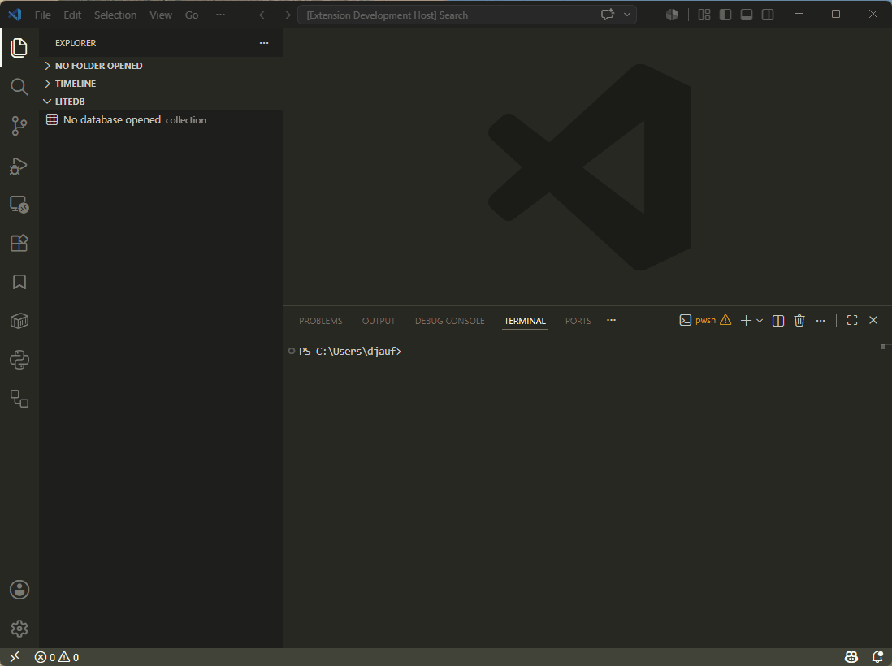
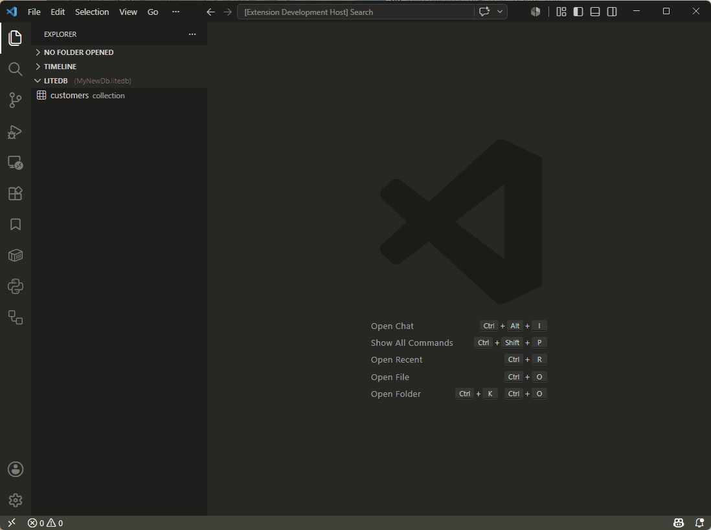
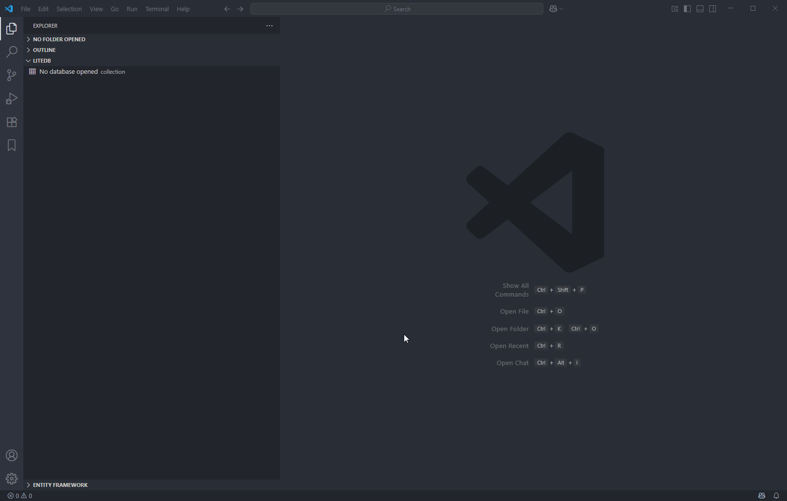
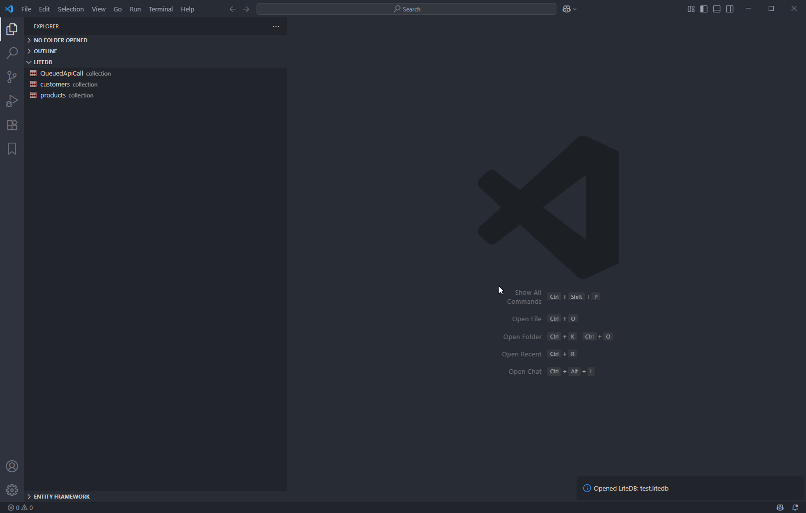
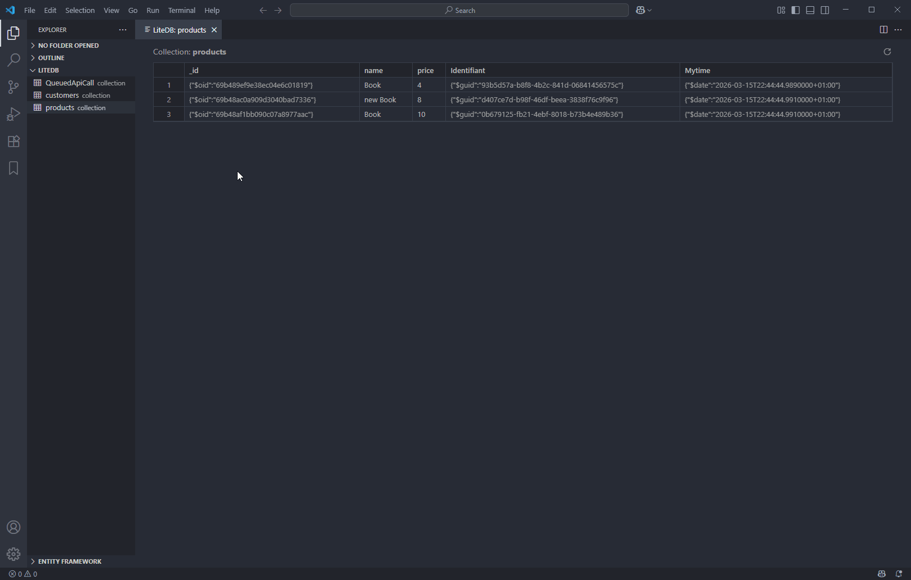

# LiteDB Explorer for VS Code

Open LiteDB databases, browse collections, run LiteDB SQL queries, and edit
simple document fields in VS Code. The extension uses a local .NET 10 bridge;
install the .NET runtime on the machine running the extension.

## Use

Use **LiteDB: Create Database** from the Command Palette or the new file icon
to the left of **Open Database** in the LiteDB Explorer view. Choose a path in
the Save dialog to create an empty `.litedb` or `.db` file and open it.



1. Run **LiteDB: Open Database** from the Command Palette or the LiteDB view
   in Explorer, then select a `.db` or `.litedb` file.
   The view header shows the file name with its original case, for example,
   **LiteDB (test.litedb)**. Long names are shortened to fit the panel.
2. Select a collection to view its documents. Use the refresh button to reload.
   Columns initially fit their displayed content, up to a readable width. Drag
   the right edge of a column header to resize it. Click a header to choose
   **Fit all columns to headers** or **Fit each column to content**. These
   controls also work in query results.
3. Click a string, number, or boolean cell to edit it; press Enter to save or
   Escape to cancel. `_id`, BSON values, nulls, and nested values are read only.
   Click nested JSON or a JSON object/array stored as text to open it formatted
   in an editor. Wide cells are capped and show an ellipsis.
4. Run **LiteDB: Run Query** to create a query editor. Press F5 to execute its
   selected text, or the whole document when nothing is selected. Results
   appear in the LiteDB Result panel.
5. Run **LiteDB: Close Database** when finished.

The query editor offers keyword and collection completion. Reload external
database changes with **LiteDB: Refresh Collections**.






## Develop

Requirements: Node.js, npm, .NET 10 SDK, and VS Code.

```sh
npm install
npm run compile
dotnet build backend/LiteDbBridge/LiteDbBridge.csproj
```

The backend project builds into `out/LiteDbBridge/`, where the extension
expects `LiteDbBridge.dll`. Press F5 in VS Code to launch an Extension
Development Host. TypeScript source is in `src/`, the bridge is in
`backend/LiteDbBridge/`, and the collection webview is in `media/gridView.html`.
See [AGENTS.md](AGENTS.md) for development invariants.

## Test locally

1. Install the prerequisites for the project: Node.js, npm, and the .NET 10 SDK.
2. From the repository root, install dependencies and build both parts of the
   extension:

   ```sh
   npm install
   npm run compile
   dotnet build backend/LiteDbBridge/LiteDbBridge.csproj
   ```

3. In VS Code, press F5 or run **Run and Debug** → **Run Extension**. This opens
   a new Extension Development Host window with the extension enabled.
4. In the new VS Code window, open the Command Palette and run **LiteDB: Open
   Database**. Pick a `.db` or `.litedb` file to validate that the bridge,
   Explorer view, and collection browser load correctly.
5. Exercise the main flows to confirm behavior:
   - open a database
   - browse a collection
   - edit a primitive value and save it
   - run a LiteDB SQL query
   - refresh collections and close the database
6. For automated validation, run:

   ```sh
   npm test
   ```

7. If you want to validate the packaged extension itself, create a VSIX with:

   ```sh
   npx vsce package
   ```

   Then install the generated `.vsix` file in VS Code to test the packaged build
   just like a published extension.

## Publish to the Marketplace

Add an Azure DevOps Personal Access Token with **Marketplace (Manage)** scope
as the GitHub repository secret `VSCE_PAT` (Settings → Secrets and variables →
Actions). The token must belong to an account authorized to publish under
`JaufrDevosse`. Do not add the token to the repository.

After merging a release with an updated `package.json` version and changelog,
create and push a matching tag on `main` (for example, `v1.0.1` for version
`1.0.1`). The [publish workflow](.github/workflows/publish-marketplace.yml)
builds the TypeScript and .NET bridge, runs tests, verifies VSIX contents, and
publishes the new version. A tag whose version differs from `package.json`, or
whose commit is not on `main`, fails before publishing. Check the workflow run
in GitHub Actions. Marketplace publishing requires a version not already
published.

Azure DevOps global PATs stop working on December 1, 2026. Plan to migrate
publishing to Microsoft Entra authentication before then.

## License

MIT. See [LICENSE.md](LICENSE.md).
